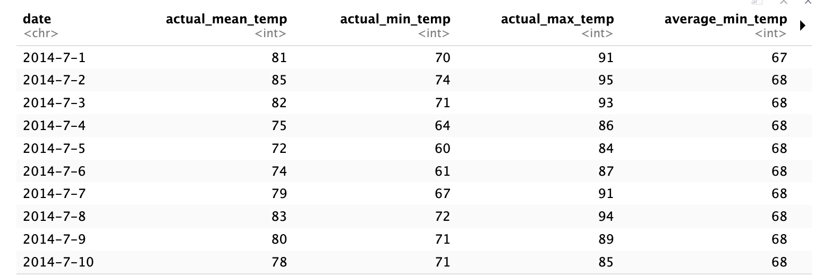

```{r}
# Provide the file path to your CSV file
file_path <- "/Users/user/Downloads/KCLT.csv"
```

```{r}
# Import the CSV file into R
data <- read.csv(file_path)
```

```{r}
# View the imported data
print(data)

```
<!-- -->

https://github.com/SaiMadhuri19/Saimadhuri_MVA/blob/af8d13afdb54f9c818c777fad1537111938a40b9/Screen%20Shot%201.png

#Q1 How does the actual temperature (actual_mean_temp, actual_min_temp, actual_max_temp) correlate
# with the average temperature (average_min_temp, average_max_temp)? 
# Is there a strong positive correlation between the actual and average temperatures, indicating consistency in weather patterns over time?


```{r}
# Load the dataset (assuming it's named 'weather_data')
weather_data <- read.csv("/Users/user/Downloads/KCLT.csv")

# Subset the dataset to include only relevant variables
subset_data <- weather_data[c("actual_mean_temp", "actual_min_temp", "actual_max_temp", 
                              "average_min_temp", "average_max_temp")]

# Calculate correlation matrix
correlation_matrix <- cor(subset_data)

# Display correlation matrix
print(correlation_matrix)


# Extract correlation coefficients
correlation_actual_avg <- correlation_matrix[1:3, 4:5]

# Display correlation coefficients between actual and average temperatures
print(correlation_actual_avg)
```

#Q2. Is there a relationship between record weather events
# (record_min_temp, record_max_temp, record_min_temp_year, record_max_temp_year,
# record_precipitation) and the actual weather conditions (actual_mean_temp, actual_min_temp,
# actual_max_temp, actual_precipitation)? For example, do extreme record temperatures
# or precipitation events coincide with higher or lower actual temperatures and 
# precipitation on the same days or within the same periods?


```{r}
# Load the dataset (assuming it's named 'weather_data')
weather_data <- read.csv("/Users/user/Downloads/KCLT.csv")

# Subset the dataset to include only relevant variables
subset_data <- weather_data[c("record_min_temp", "record_max_temp", "record_min_temp_year", 
                              "record_max_temp_year", "record_precipitation",
                              "actual_mean_temp", "actual_min_temp", "actual_max_temp", 
                              "actual_precipitation")]

# Calculate correlation matrix
correlation_matrix <- cor(subset_data)

# Display correlation matrix
print(correlation_matrix)

# Create scatterplots
pairs(subset_data)


```
